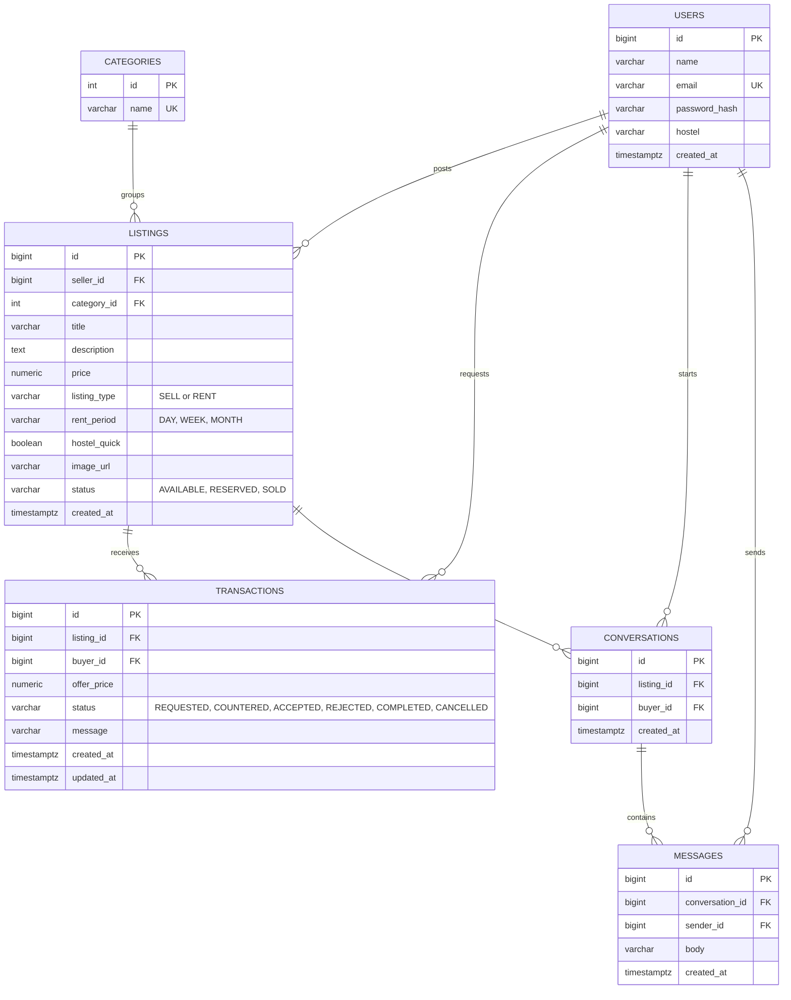

# Database design

Paste the block below into https://mermaid.live to export an image for your report.

```mermaid
erDiagram
    USERS ||--o{ LISTINGS : posts
    CATEGORIES ||--o{ LISTINGS : groups
    LISTINGS ||--o{ TRANSACTIONS : receives
    USERS ||--o{ TRANSACTIONS : requests
    LISTINGS ||--o{ CONVERSATIONS : discussed_in
    USERS ||--o{ CONVERSATIONS : starts
    CONVERSATIONS ||--o{ MESSAGES : contains
    USERS ||--o{ MESSAGES : sends

    USERS {
        bigint id PK
        varchar name
        varchar email UK
        varchar password_hash
        varchar hostel
        timestamptz created_at
    }
    CATEGORIES {
        int id PK
        varchar name UK
    }
    LISTINGS {
        bigint id PK
        bigint seller_id FK
        int category_id FK
        varchar title
        text description
        numeric price
        varchar listing_type "SELL or RENT"
        varchar rent_period "DAY, WEEK, MONTH"
        boolean hostel_quick
        varchar image_url
        varchar status "AVAILABLE, RESERVED, SOLD"
        timestamptz created_at
    }
    TRANSACTIONS {
        bigint id PK
        bigint listing_id FK
        bigint buyer_id FK
        numeric offer_price
        varchar status "REQUESTED, COUNTERED, ACCEPTED, REJECTED, COMPLETED, CANCELLED"
        varchar message
        timestamptz created_at
        timestamptz updated_at
    }
    CONVERSATIONS {
        bigint id PK
        bigint listing_id FK
        bigint buyer_id FK
        timestamptz created_at
    }
    MESSAGES {
        bigint id PK
        bigint conversation_id FK
        bigint sender_id FK
        varchar body
        timestamptz created_at
    }
```
